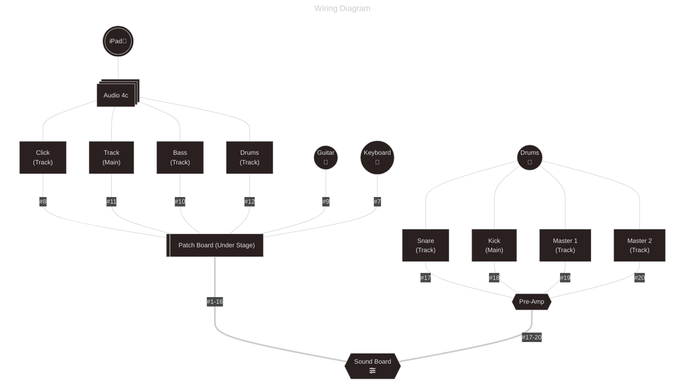
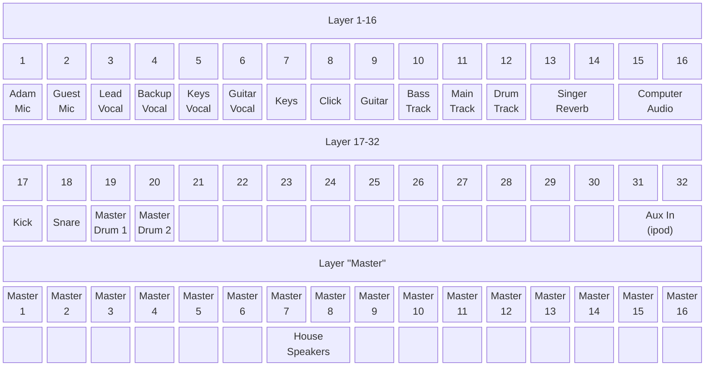

# Connect UMC Sound

## Wiring Diagram

```mermaid
---
config:
  theme: neo-dark
title: Wiring Diagram
---
flowchart
	board@{ shape: "hex", label: "Sound Board\nfa:fa-sliders" }
	patch@{ shape: "lin-rect", label: "Patch Board (Under Stage)" }
	ipad@{ shape: "dbl-circ", label: "iPad📱" }
	a4c@{ shape: "st-rect", label: "Audio 4c" }
    subgraph sg_instruments[" "]
        i_guitar@{ shape: "circle", label: "Guitar\n🎸" }
        i_keys@{ shape: "circle", label: "Keyboard\n🎹" }
        i_drums@{ shape: "circle", label: "Drums\n🥁" }
    end
    subgraph sg_drums[" "]
        preamp@{ shape: "hex", label: "Pre-Amp" }
        snare@{ shape: "rectangle", label: "Snare\n(Track)" }
        kick@{ shape: "rectangle", label: "Kick\n(Main)" }
        master1@{ shape: "rectangle", label: "Master 1\n(Track)" }
        master2@{ shape: "rectangle", label: "Master 2\n(Track)" }
    end
	subgraph sg_tracks[" "]
        t_click@{ shape: "rectangle", label: "Click\n(Track)" }
        t_track@{ shape: "rectangle", label: "Track\n(Main)" }
        t_bass@{ shape: "rectangle", label: "Bass\n(Track)" }
        t_drum@{ shape: "rectangle", label: "Drums\n(Track)" }
	end
	patch ===|"#1-16"| board
    preamp === |"#17-20"| board
	ipad --- a4c
	a4c --- t_click & t_track & t_bass & t_drum
    t_click ---|"#8"| patch 
    t_track ---|"#11"| patch
    t_bass ---|"#10"| patch
    t_drum ---|"#12"| patch
    i_guitar ---|"#9"| patch
    i_keys ---|"#7"| patch
    i_drums --- snare & kick & master1 & master2
    snare ---|"#17"| preamp
    kick ---|"#18"| preamp
    master1 ---|"#19"| preamp
    master2 ---|"#20"| preamp
    style sg_tracks color:#000000,fill:#FFFFFF00,stroke:#FFFFFF00
    style sg_instruments color:#000000,fill:#FFFFFF00,stroke:#FFFFFF00
    style sg_drums color:#000000,fill:#FFFFFF00,stroke:#FFFFFF00
```
## Layer Chart

```mermaid
block-beta
    columns 16
    layer_1_16["Layer 1-16"]:16
    1
    2
    3
    4
    5
    6
    7
    8
    9
    10
    11
    12
    13
    14
    15
    16
    label_1["Adam\nMic"]
    label_2["Guest\nMic"]
    label_3["Lead\nVocal"]
    label_4["Backup\nVocal"]
    label_5["Keys\nVocal"]
    label_6["Guitar\nVocal"]
    label_7["Keys"]
    label_8["Click"]
    label_9["Guitar"]
    label_10["Bass\nTrack"]
    label_11["Main\nTrack"]
    label_12["Drum\nTrack"]
    label_13_14["Singer\nReverb"]:2
    label_15_16["Computer\nAudio"]:2
    layer_17_32["Layer 17-32"]:16
    17
    18
    19
    20
    21
    22
    23
    24
    25
    26
    27
    28
    29
    30
    31
    32
    label_17["Kick"]
    label_18["Snare"]
    label_19["Master\nDrum 1"]
    label_20["Master\nDrum 2"]
    label_21[" "]
    label_22[" "]
    label_23[" "]
    label_24[" "]
    label_25[" "]
    label_26[" "]
    label_27[" "]
    label_28[" "]
    label_29[" "]
    label_30[" "]
    label_31_32["Aux In\n(ipod)"]:2
    layer_master["Layer ''Master'' "]:16
    master_1["Master\n1"]
    master_2["Master\n2"]
    master_3["Master\n3"]
    master_4["Master\n4"]
    master_5["Master\n5"]
    master_6["Master\n6"]
    master_7["Master\n7"]
    master_8["Master\n8"]
    master_9["Master\n9"]
    master_10["Master\n10"]
    master_11["Master\n11"]
    master_12["Master\n12"]
    master_13["Master\n13"]
    master_14["Master\n14"]
    master_15["Master\n15"]
    master_16["Master\n16"]
    label_master_1[" "]
    label_master_2[" "]
    label_master_3[" "]
    label_master_4[" "]
    label_master_5[" "]
    label_master_6[" "]
    label_master_7_8["House\nSpeakers"]:2
    label_master_9[" "]
    label_master_10[" "]
    label_master_11[" "]
    label_master_12[" "]
    label_master_13[" "]
    label_master_14[" "]
    label_master_15[" "]
    label_master_16[" "]
  

```
